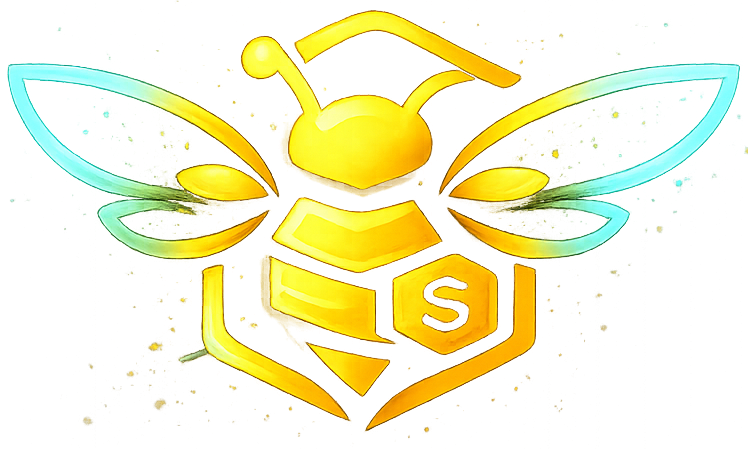

<div align="center">



# 🍯 TipHive

**The Bitcoin-Native Creator Economy — Built on Mezo L2**

*Zero fees. Instant settlements. Non-custodial. Permissionless.*

[](https://opensource.org/licenses/MIT)
[](https://nextjs.org/)
[](https://mezo.org/)
[](https://supabase.com/)

</div>

---

## 📖 What is TipHive?

TipHive is a **full-stack, decentralized creator monetization platform** built on the Mezo Bitcoin L2 network. It enables any creator — artist, developer, streamer, writer — to receive direct financial support from their audience using **MUSD** (a Bitcoin-backed stablecoin), with zero platform fees and instant on-chain settlement.

Unlike Patreon, Buy Me a Coffee, or Twitch — TipHive is **non-custodial**. No middlemen. No holding periods. The smart contract *is* the payment processor.

---

## ❌ The Problem We're Solving

| Traditional Platforms | TipHive |
|---|---|
| Take 30–50% of every tip | **0% platform fee — forever** |
| Payouts take 7–30 days | **Instant on-chain settlement (<5s)** |
| Can freeze or ban your account | **Non-custodial, permissionless** |
| Require KYC & bank accounts | **Just connect a wallet** |
| Volatile crypto payouts | **Stable MUSD (pegged to $1)** |

---

## ✨ Core Features

### 🎨 Creator Profiles & Identity
- Wallet-based identity (no email/password needed)
- Fully customizable public profile page (`/@username`)
- Custom banner, avatar, bio, social links, category
- Animated sticky header with follower & earnings stats

### ⚡ Direct Tipping (One-Time Support)
- Send MUSD instantly to any creator on Mezo L2
- Custom tip amounts + suggested quick-select buttons
- Creator-defined button labels (e.g., "Buy me a coffee ☕")
- Custom thank you messages after every tip
- 0% platform fee — funds go straight to creator's wallet

### 💎 Tiered Subscriptions (Recurring Revenue)
- Creators define multi-tier membership plans (Bronze/Silver/Gold)
- Monthly MUSD payments enforced by on-chain smart contracts
- Active / Cancelled / Expired states managed by the contract
- Subscribers unlock exclusive content automatically

### 📝 Content Drops (Posts)
Creators can publish rich content with **3 visibility modes**:
- 🌍 **Public** — Visible to everyone, indexed in the Explore feed
- 👥 **Followers Only** — Rewards your community, drives follows
- 🔒 **Supporters Only** — Paywalled behind an active subscription

Posts support:
- **Rich Text** (Tiptap editor with full formatting)
- **Image uploads** (via Cloudinary CDN)
- **Video uploads** (via Cloudinary CDN)
- **Likes & Comments** system with real-time Supabase updates

### 🔍 Explore & Discovery
- Scroll-reactive feed of active creators and their latest drops
- Animated `TopCreatorsBubbles` leaderboard with rainbow glow effects
- Real-time search by creator name or username
- Infinite scroll with Intersection Observer API
- Follow/Unfollow directly from the feed

### 📊 Creator Dashboard
Full-featured creator command center at `/dashboard`:
| Section | Description |
|---|---|
| **Hive (Overview)** | On-chain balance from tips + subscriptions |
| **Tip Circles** | Manage tipping settings & visual customization |
| **Subscriptions** | Create and manage membership tier plans |
| **Drops** | Full-screen rich-text editor for creating posts |
| **Activity Feed** | Real-time log of all tips sent and received |
| **Analytics** | Chart.js-powered earnings visualization |
| **Sent Support** | History of tips you've sent to other creators |
| **My Subscriptions** | Subscriptions you're currently paying for |
| **Visual Toolkit** | Button, Widget, and QR Code generators |

### 🛠️ Visual Toolkit (Embeddable Assets)
Creators can generate ready-to-use assets from the dashboard:
- **QR Code** — Branded PNG/SVG for streaming overlays, business cards
- **HTML Button** — Copy-paste HTML snippet for any website
- **JavaScript Widget** — One-line `<script>` tag embeds a full tipping UI

### 💬 Real-Time Messaging & Social
- **Direct Messaging** — Instant chat between fans and creators powered by Supabase Realtime.
- **Privacy First** — RLS-protected threads ensure messages stay between sender and receiver.
- **Social Drops** — Share exclusive content links and tips directly within message threads.

### 📈 Growth & Referrals
- **Referral Program** — Users earn rewards by inviting new creators via unique links.
- **On-Chain Tracking** — Referrals are permanently linked to the user's DID in the database.
- **Dashboard Stats** — Track your network's growth and referral revenue in real-time.

### ✉️ Email Notifications (Brevo)
- **High-Priority Alerts** — Instant emails for tips received, new subscribers, and security events.
- **Custom Preferences** — Users can toggle different notification types in their account settings.
- **Branded Delivery** — Transactional emails styled to match the TipHive aesthetic.

---

## 🔌 API Reference (V1)

TipHive provides a public REST API for external integrations.

### `GET /api/v1/button`
Renders a dynamic, high-resolution **SVG tipping button** in real-time.

```
GET /api/v1/button?slug=USERNAME&color=F7931A&text=Support+Me&emoji=⚡&count=true
```

| Parameter | Type | Required | Description |
|---|---|---|---|
| `slug` | string | ✅ | Creator's TipHive username |
| `color` | string | ❌ | Hex color code (default: `f7931a`) |
| `text` | string | ❌ | Button label text |
| `emoji` | string | ❌ | Emoji prefix for the button |
| `count` | boolean | ❌ | Show live unique supporter count |
| `font` | string | ❌ | Font family name |

**Response:** `image/svg+xml` — A fully rendered, dynamic SVG button.

---

### `GET /api/v1/widget`
Returns a **JavaScript loader** that injects a styled tipping button anywhere.

```html
<!-- Paste anywhere on your site -->
<script
  src="https://tiphive.com/api/v1/widget"
  data-name="tiphive-button"
  data-slug="YOUR_USERNAME"
  data-color="f7931a"
  data-text="Support My Work"
  data-emoji="⚡"
  async>
</script>
```

**Response:** `application/javascript` — A self-executing script that auto-injects the button.

---

### Internal API Routes

| Route | Method | Description |
|---|---|---|
| `/api/auth` | `GET` | Wallet connect: find-or-create a user profile. Auto-generates username & avatar. |
| `/api/profile` | `GET/POST` | Read or update creator settings (bio, tipping config, social links). |
| `/api/profile/check-username` | `GET` | Check if a username is available before claiming. |
| `/api/upload` | `POST` | Secure media upload handler. Accepts images/videos, uploads to Cloudinary. |
| `/api/notifications` | `GET` | Fetch real-time activity notifications for the connected wallet. |
| `/api/email` | `POST` | Save notification email preferences for a wallet address. |

---

## 🏗️ Technical Architecture

### How a Tip Works (End-to-End)

```
Fan clicks "Tip" button
        ↓
RainbowKit opens wallet modal
        ↓
Wagmi prepares ERC-20 approve() tx for MUSD
        ↓
TippingContract.tip(creatorAddress, amount) called on Mezo L2
        ↓
On-chain event fires → Supabase updated via backend
        ↓
Creator's balance increases. Funds available instantly to withdraw.
```

### Database Schema (Supabase / PostgreSQL)

| Table | Purpose |
|---|---|
| `user_profiles` | Unified identity for fans & creators (wallet-based) |
| `posts` | Creator drops with content, media URLs, visibility, creator_id |
| `post_likes` | Many-to-many likes, keyed by post_id + user_address |
| `post_comments` | Threaded comments per post |
| `tips` | Historical record of all on-chain tips |
| `subscriptions` | Active, cancelled, or expired fan-creator subscriptions |
| `subscription_plans` | Creator-defined tier names, prices, and descriptions |
| `followers` | Fan → Creator follow relationships |
| `notifications` | Activity feed entries per wallet |

### Smart Contracts (Mezo Testnet)

| Contract | Function |
|---|---|
| **TippingContract** | `tip()`, `getCreatorBalance()`, `withdraw()` |
| **SubscriptionContract** | `subscribe()`, `getCreatorEarnings()`, `withdrawEarnings()` |
| **MUSD (ERC-20)** | Standard `approve()` / `transferFrom()` used for all payments |

---

## 💻 Full Tech Stack

### Frontend
| Technology | Role |
|---|---|
| **Next.js 16** (Turbopack) | App Router, SSR, API Routes |
| **TypeScript** | 100% type-safe codebase |
| **Tailwind CSS 4** | Utility-first styling system |
| **Framer Motion** | Page transitions & micro-animations |
| **Lenis** | Smooth scroll physics |
| **Tiptap** | Rich text editor for Drops |
| **Chart.js + React-Chartjs-2** | Earnings analytics visualization |
| **TanStack Query** | Server state management & caching |
| **Lucide React** | Icon library |

### Web3 Layer
| Technology | Role |
|---|---|
| **Wagmi v3** | React hooks for all on-chain reads/writes |
| **Viem** | Low-level Ethereum client (type-safe) |
| **RainbowKit** | Wallet connection UI (MetaMask, Rainbow, etc.) |
| **Mezo L2** | Bitcoin Economic Layer — our blockchain |
| **MUSD** | Bitcoin-backed stablecoin, primary currency |

### Backend & Infrastructure
| Technology | Role |
|---|---|
| **Supabase** | PostgreSQL DB + Row Level Security (RLS) + Realtime |
| **Cloudinary** | Media uploads, optimization, and CDN delivery |
| **Privy** | Non-custodial wallet authentication and social login |
| **Brevo** | Transactional email automation and notifications |
| **DiceBear** | Auto-generated avatar for new wallets |

---

## 🚀 Getting Started

### Prerequisites
- Node.js 20+
- A Mezo Testnet wallet (MetaMask or RainbowKit-compatible)
- A Supabase project
- A Cloudinary account

### 1. Install Dependencies

```bash
npm install
```

### 2. Configure Environment

Copy `.env.example` to `.env.local` and fill in:

```env
# Supabase
NEXT_PUBLIC_SUPABASE_URL=https://your-project.supabase.co
NEXT_PUBLIC_SUPABASE_ANON_KEY=your-anon-key
SUPABASE_SERVICE_ROLE_KEY=your-service-role-key

# Cloudinary
NEXT_PUBLIC_CLOUDINARY_CLOUD_NAME=your-cloud-name
CLOUDINARY_API_KEY=your-api-key
CLOUDINARY_API_SECRET=your-api-secret

# Mezo Network
NEXT_PUBLIC_MEZO_NETWORK_ID=31611
NEXT_PUBLIC_MUSD_ADDRESS=0x...
```

### 3. Start Development Server

```bash
npm run dev
```

Open [http://localhost:3000](http://localhost:3000).

### 4. Build for Production

```bash
npm run build
```

---

## 💡 Why Mezo L2?

We specifically chose **Mezo** as our execution layer because:

1. **Bitcoin Security** — Mezo is secured by the Bitcoin network, the most battle-tested blockchain in existence. Creator funds are as safe as Bitcoin itself.
2. **MUSD Stability** — A Bitcoin-backed stablecoin means creators earn in USD-denominated value without worrying about BTC price swings.
3. **HODL Proof-of-Stake** — Aligns our platform's long-term incentives with the Bitcoin community.
4. **EVM Compatibility** — Lets us use the modern Wagmi/Viem/Solidity toolchain builders already know.
5. **Low Fees** — Makes micro-tipping ($1, $5, $10) economically viable for global audiences.

---

**Built with ❤️ for the Mezo Hackathon.**
